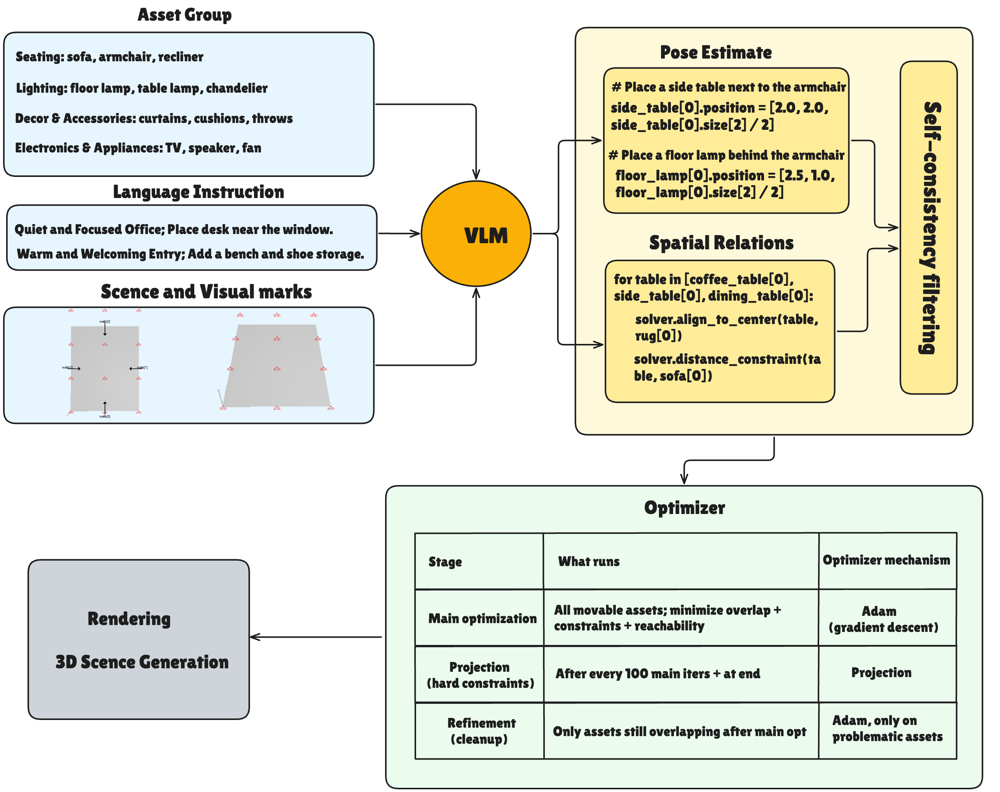
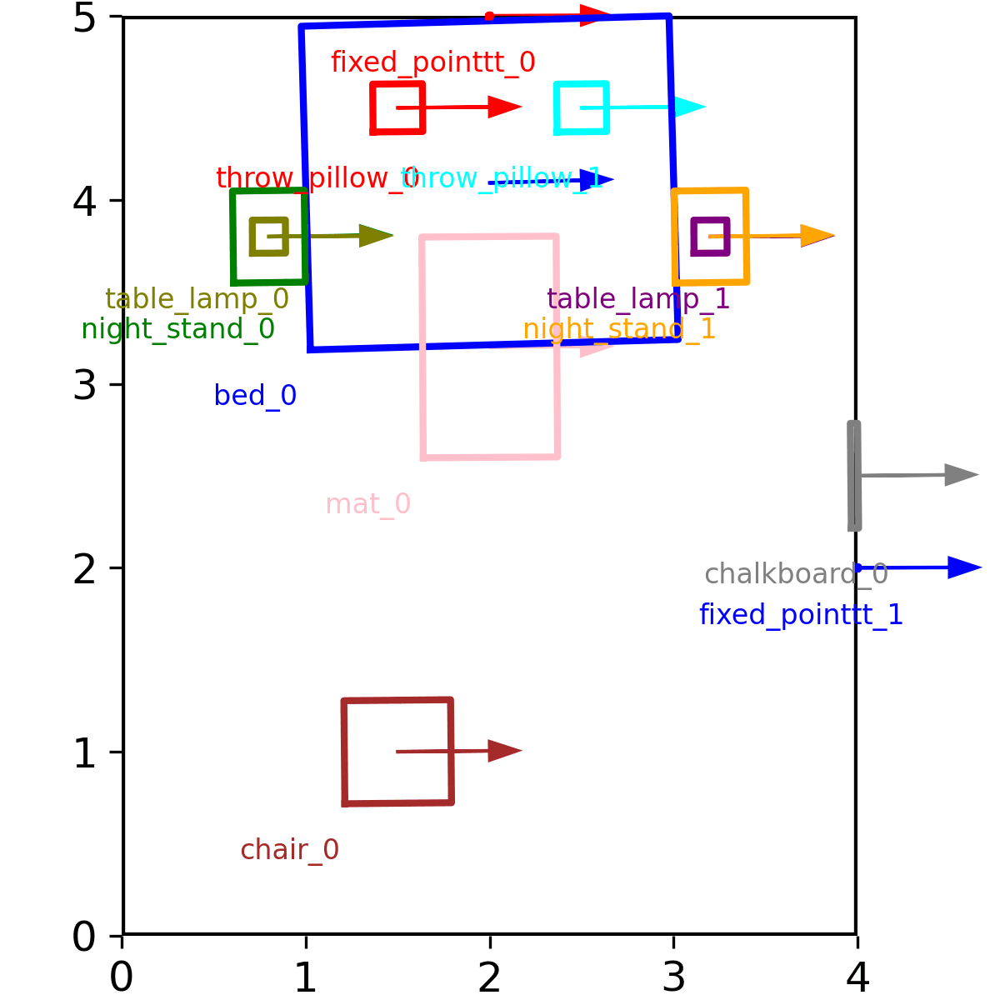
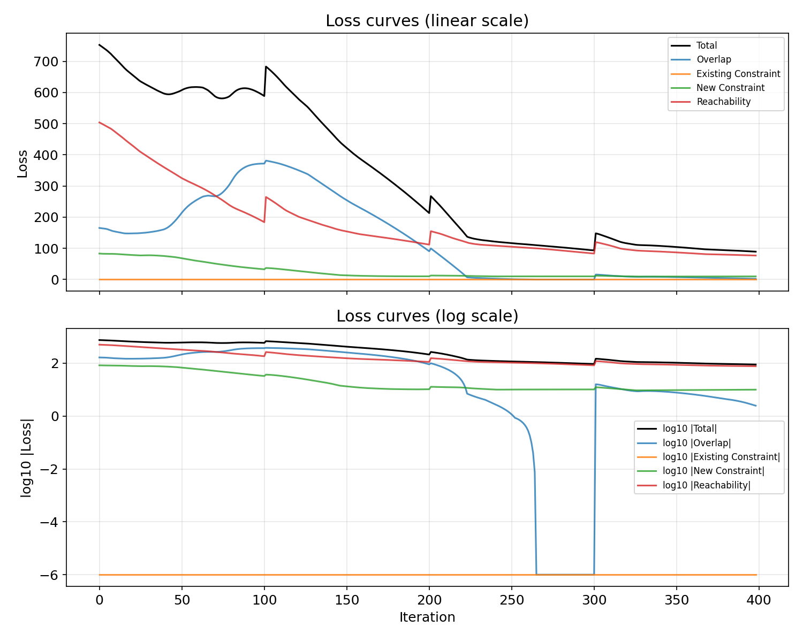

# RoboLayout

## Overview

This repository extends [LayoutVLM](https://github.com/StanfordVL/layoutvlm) with agent-aware layout optimization for indoor scenes. It introduces explicit differentiable reachability constraints to ensure generated layouts are navigable and actionable by embodied agents with diverse physical capabilities (e.g., robots, humans, animals). The framework also includes a local refinement stage that selectively re-optimizes problematic object placements without rerunning full-scene optimization, improving stability and convergence while preserving semantic and physical plausibility.

## Architecture
RoboLayout comprises three main layers. Orchestration: The central orchestrator responsible for coordinating group-ings, rendering and other cognitive processes of the solver and sandbox. Sandbox: Translates constraints into feasible scene layouts. Solver: optimizer based on hard and soft constraints for spatial arrangements and refinement of the final optimized scene. Following shows the architecture diagram:

<p align="center">
  
</p>


## Installation

1. Clone this repository
2. Install dependencies (python 3.11):

```bash
pip install -r requirements.txt
```

3. Install Rotated IOU Loss ([https://github.com/lilanxiao/Rotated\_IoU](https://github.com/lilanxiao/Rotated\_IoU))

```
cd third_party/Rotated_IoU/cuda_op
python setup.py install
```

4. To run the code:

```
python main.py \                                                                        
  --scene_json_file benchmark_tasks/...json \
  --openai_api_key Your-Key \
  --save_dir ./results/... \
  --model gpt-4o \
  --asset_dir ./objaverse_processed
```

5. The final GIF showing progress of layout optimization (2D top-down view of furniture placement) is saved as `final.gif` in your results folder (e.g. `results/test_run/final.gif`). Example:

<p align="center">
  
</p>


6. Loss curves to watch progress of optimization can be found in `results/loss`. Example:

<p align="center">
  
</p>


## Data preprocessing

1. Download the dataset [https://drive.google.com/file/d/1WGbj8gWn-f-BRwqPKfoY06budBzgM0pu/view?usp=sharing](https://drive.google.com/file/d/1WGbj8gWn-f-BRwqPKfoY06budBzgM0pu/view?usp=sharing)
2. Unzip it.

Refer to [https://github.com/allenai/Holodeck](https://github.com/allenai/Holodeck) and [https://github.com/allenai/objathor](https://github.com/allenai/objathor) for how we preprocess Objaverse assets.

## Usage

Prepare a scene configuration JSON file of Objaverse assets with the following structure:

```json
{
    "task_description": ...,
    "layout_criteria": ...,
    "boundary": {
        "floor_vertices": [[x1, y1, z1], [x2, y2, z2], ...],
        "wall_height": height
    },
    "assets": {
        "asset_id": {
            "path": "path/to/asset.glb",
            "assetMetadata": {
                "boundingBox": {
                    "x": width,
                    "y": depth,
                    "z": height
                }
            }
        }
    }
}
```

## Output

The script will generate a layout.json file in the specified save directory containing the optimized positions and orientations of all assets in the scene.

## BibTeX

```bibtex
@inproceedings{RoboLayout,
  title={RoboLayout: A Semantics-Driven 3D Layout Optimizer with Robotic Reachability Constraints},
  author={Ali Shamsaddinlou}
}
```
